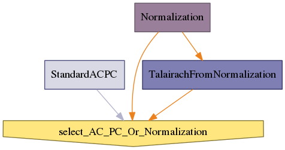

.. AUTO-GENERATED FILE -- DO NOT EDIT!

:orphan:

morphologist.capsul.axon.brainorientation.BrainOrientation
==========================================================

.. _morphologist.capsul.axon.brainorientation.BrainOrientation:

BrainOrientation
----------------

.. currentmodule:: morphologist.capsul.axon.brainorientation

.. note::

    * Type 'BrainOrientation.help()' for a full description of this process parameters.
    * Type '<BrainOrientation>.get_input_spec()' for a full description of this process input trait types.
    * Type '<BrainOrientation>.get_output_spec()' for a full description of this process output trait types.

Inputs
~~~~~~

[Mandatory]

+------------------------------------------------------------------------------+
| | **select_AC_PC_Or_Normalization**: a legal value (['Enum'] - mandatory)    |
| |     No description.                                                        |
+------------------------------------------------------------------------------+
| | **T1mri**: a file name (['File'] - mandatory)                              |
| |     No description.                                                        |
+------------------------------------------------------------------------------+
| | **nodes_activation**: a legal value (['ControllerTrait'] - mandatory)      |
| |     No description.                                                        |
+------------------------------------------------------------------------------+
| | **allow_flip_initial_MRI**: a boolean (['Bool'] - mandatory)               |
| |     No description.                                                        |
+------------------------------------------------------------------------------+

[Optional]

+----------------------------------------------------------------------------------------+
| | **Normalization_NormalizeFSL_ConvertFSLnormalizationToAIMS_standard_template**: a    |
| |      legal value (['Enum'] - optional)                                               |
| |     No description.                                                                  |
+----------------------------------------------------------------------------------------+
| | **StandardACPC_older_MNI_normalization**: a file name (['File'] -                    |
| |     optional)                                                                        |
| |     No description.                                                                  |
+----------------------------------------------------------------------------------------+
| | **StandardACPC_Posterior_Commissure**: a legal value (['List_Float'] -               |
| |     optional)                                                                        |
| |     No description.                                                                  |
+----------------------------------------------------------------------------------------+
| | **Normalization_Normalization_AimsMIRegister_mni_to_acpc**: a file name              |
| |     (['File'] - optional)                                                            |
| |     No description.                                                                  |
+----------------------------------------------------------------------------------------+
| | **Normalization_NormalizeSPM_NormalizeSPM_nbiteration**: an integer                  |
| |     (['Int'] - optional)                                                             |
| |     No description.                                                                  |
+----------------------------------------------------------------------------------------+
| | **StandardACPC_Anterior_Commissure**: a legal value (['List_Float'] -                |
| |     optional)                                                                        |
| |     No description.                                                                  |
+----------------------------------------------------------------------------------------+
| | **StandardACPC_Interhemispheric_Point**: a legal value (['List_Float'] -             |
| |     optional)                                                                        |
| |     No description.                                                                  |
+----------------------------------------------------------------------------------------+
| | **Normalization_commissures_coordinates**: a file name (['File'] -                   |
| |     optional)                                                                        |
| |     No description.                                                                  |
+----------------------------------------------------------------------------------------+
| | **Normalization_NormalizeFSL_NormalizeFSL_cost_function**: a legal value             |
| |     (['Enum'] - optional)                                                            |
| |     No description.                                                                  |
+----------------------------------------------------------------------------------------+
| | **StandardACPC_Left_Hemisphere_Point**: a legal value (['List_Float'] -              |
| |     optional)                                                                        |
| |     No description.                                                                  |
+----------------------------------------------------------------------------------------+
| | **Normalization_NormalizeSPM_ConvertSPMnormalizationToAIMS_target**: a               |
| |     legal value (['Enum'] - optional)                                                |
| |     No description.                                                                  |
+----------------------------------------------------------------------------------------+
| | **Normalization_NormalizeBaladin_template**: a file name (['File'] -                 |
| |     optional)                                                                        |
| |     No description.                                                                  |
+----------------------------------------------------------------------------------------+
| | **TalairachFromNormalization_acpc_referential**: a file name (['File'] -             |
| |     optional)                                                                        |
| |     No description.                                                                  |
+----------------------------------------------------------------------------------------+
| | **Normalization_select_Normalization_pipeline**: a legal value (['Enum'] -           |
| |     optional)                                                                        |
| |     No description.                                                                  |
+----------------------------------------------------------------------------------------+
| | **Normalization_NormalizeSPM_ConvertSPMnormalizationToAIMS_removeSource**: a         |
| |      boolean (['Bool'] - optional)                                                   |
| |     No description.                                                                  |
+----------------------------------------------------------------------------------------+
| | **Normalization_NormalizeFSL_NormalizeFSL_search_cost_function**: a legal            |
| |     value (['Enum'] - optional)                                                      |
| |     No description.                                                                  |
+----------------------------------------------------------------------------------------+
| | **Normalization_NormalizeBaladin_set_transformation_in_source_volume**: a            |
| |     boolean (['Bool'] - optional)                                                    |
| |     No description.                                                                  |
+----------------------------------------------------------------------------------------+
| | **TalairachFromNormalization_transform_chain_ACPC_to_Normalized**: a file            |
| |     name (['File'] - optional)                                                       |
| |     No description.                                                                  |
+----------------------------------------------------------------------------------------+
| | **Normalization_Normalization_AimsMIRegister_anatomical_template**: a file           |
| |     name (['File'] - optional)                                                       |
| |     No description.                                                                  |
+----------------------------------------------------------------------------------------+
| | **Normalization_NormalizeSPM_template**: a file name (['File'] - optional)           |
| |     No description.                                                                  |
+----------------------------------------------------------------------------------------+
| | **Normalization_NormalizeSPM_ConvertSPMnormalizationToAIMS_normalized_volume**: a    |
| |      file name (['File'] - optional)                                                 |
| |     No description.                                                                  |
+----------------------------------------------------------------------------------------+
| | **Normalization_NormalizeSPM_NormalizeSPM_cutoff_option**: an integer                |
| |     (['Int'] - optional)                                                             |
| |     No description.                                                                  |
+----------------------------------------------------------------------------------------+
| | **Normalization_NormalizeSPM_allow_retry_initialization**: a boolean                 |
| |     (['Bool'] - optional)                                                            |
| |     No description.                                                                  |
+----------------------------------------------------------------------------------------+
| | **Normalization_NormalizeFSL_allow_retry_initialization**: a boolean                 |
| |     (['Bool'] - optional)                                                            |
| |     No description.                                                                  |
+----------------------------------------------------------------------------------------+
| | **Normalization_NormalizeFSL_alignment**: a legal value (['Enum'] -                  |
| |     optional)                                                                        |
| |     No description.                                                                  |
+----------------------------------------------------------------------------------------+
| | **Normalization_Normalization_AimsMIRegister_smoothing**: a float                    |
| |     (['Float'] - optional)                                                           |
| |     No description.                                                                  |
+----------------------------------------------------------------------------------------+
| | **StandardACPC_remove_older_MNI_normalization**: a boolean (['Bool'] -               |
| |     optional)                                                                        |
| |     No description.                                                                  |
+----------------------------------------------------------------------------------------+
| | **TalairachFromNormalization_source_referential**: a file name (['File'] -           |
| |     optional)                                                                        |
| |     No description.                                                                  |
+----------------------------------------------------------------------------------------+
| | **StandardACPC_Normalised**: a legal value (['Enum'] - optional)                     |
| |     No description.                                                                  |
+----------------------------------------------------------------------------------------+
| | **Normalization_NormalizeSPM_NormalizeSPM_voxel_size**: a legal value                |
| |     (['Enum'] - optional)                                                            |
| |     No description.                                                                  |
+----------------------------------------------------------------------------------------+
| | **Normalization_NormalizeFSL_template**: a file name (['File'] - optional)           |
| |     No description.                                                                  |
+----------------------------------------------------------------------------------------+
| | **Normalization_NormalizeSPM_NormalizeSPM_init_translation_origin**: a               |
| |     legal value (['Enum'] - optional)                                                |
| |     No description.                                                                  |
+----------------------------------------------------------------------------------------+
| | **TalairachFromNormalization_normalized_referential**: a file name                   |
| |     (['File'] - optional)                                                            |
| |     No description.                                                                  |
+----------------------------------------------------------------------------------------+
| | **Normalization_NormalizeFSL_NormalizeFSL_init_translation_origin**: a               |
| |     legal value (['Enum'] - optional)                                                |
| |     No description.                                                                  |
+----------------------------------------------------------------------------------------+
| | **Normalization_NormalizeFSL_set_transformation_in_source_volume**: a bool           |
| |     ean (['Bool'] - optional)                                                        |
| |     No description.                                                                  |
+----------------------------------------------------------------------------------------+

Outputs
~~~~~~~

+-----------------------------------------------------------------------------------+
| | **Normalization_NormalizeSPM_NormalizeSPM_job_file**: a file name               |
| |     No description.                                                             |
+-----------------------------------------------------------------------------------+
| | **commissure_coordinates**: any value                                           |
| |     No description.                                                             |
+-----------------------------------------------------------------------------------+
| | **Normalization_Normalization_AimsMIRegister_transformation_to_template**: a    |
| |      file name                                                                  |
| |     No description.                                                             |
+-----------------------------------------------------------------------------------+
| | **Normalization_NormalizeBaladin_NormalizeBaladin_transformation_matrix**: a    |
| |      file name                                                                  |
| |     No description.                                                             |
+-----------------------------------------------------------------------------------+
| | **reoriented_t1mri**: any value                                                 |
| |     No description.                                                             |
+-----------------------------------------------------------------------------------+
| | **Normalization_Normalization_AimsMIRegister_transformation_to_ACPC**: a f      |
| |     ile name                                                                    |
| |     No description.                                                             |
+-----------------------------------------------------------------------------------+
| | **Normalization_normalized**: any value                                         |
| |     No description.                                                             |
+-----------------------------------------------------------------------------------+
| | **talairach_transformation**: any value                                         |
| |     No description.                                                             |
+-----------------------------------------------------------------------------------+
| | **Normalization_NormalizeFSL_NormalizeFSL_transformation_matrix**: a file       |
| |     name                                                                        |
| |     No description.                                                             |
+-----------------------------------------------------------------------------------+
| | **Normalization_NormalizeSPM_spm_transformation**: a file name                  |
| |     No description.                                                             |
+-----------------------------------------------------------------------------------+

Pipeline schema
~~~~~~~~~~~~~~~

