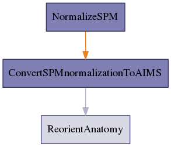

.. AUTO-GENERATED FILE -- DO NOT EDIT!

:orphan:

morphologist.capsul.axon.spmnormalizationpipeline.SPMnormalizationPipeline
==========================================================================

.. _morphologist.capsul.axon.spmnormalizationpipeline.SPMnormalizationPipeline:

SPMnormalizationPipeline
------------------------

.. currentmodule:: morphologist.capsul.axon.spmnormalizationpipeline

.. note::

    * Type 'SPMnormalizationPipeline.help()' for a full description of this process parameters.
    * Type '<SPMnormalizationPipeline>.get_input_spec()' for a full description of this process input trait types.
    * Type '<SPMnormalizationPipeline>.get_output_spec()' for a full description of this process output trait types.

Inputs
~~~~~~

[Mandatory]

+----------------------------------------------------------------------------+
| | **t1mri**: a file name (['File'] - mandatory)                            |
| |     No description.                                                      |
+----------------------------------------------------------------------------+
| | **allow_retry_initialization**: a boolean (['Bool'] - mandatory)         |
| |     No description.                                                      |
+----------------------------------------------------------------------------+
| | **nodes_activation**: a legal value (['ControllerTrait'] - mandatory)    |
| |     No description.                                                      |
+----------------------------------------------------------------------------+
| | **allow_flip_initial_MRI**: a boolean (['Bool'] - mandatory)             |
| |     No description.                                                      |
+----------------------------------------------------------------------------+

[Optional]

+---------------------------------------------------------------------------------+
| | **ReorientAnatomy_commissures_coordinates**: a file name (['File'] -          |
| |     optional)                                                                 |
| |     No description.                                                           |
+---------------------------------------------------------------------------------+
| | **NormalizeSPM_nbiteration**: an integer (['Int'] - optional)                 |
| |     No description.                                                           |
+---------------------------------------------------------------------------------+
| | **NormalizeSPM_cutoff_option**: an integer (['Int'] - optional)               |
| |     No description.                                                           |
+---------------------------------------------------------------------------------+
| | **NormalizeSPM_voxel_size**: a legal value (['Enum'] - optional)              |
| |     No description.                                                           |
+---------------------------------------------------------------------------------+
| | **ConvertSPMnormalizationToAIMS_normalized_volume**: a file name (['File']    |
| |     - optional)                                                               |
| |     No description.                                                           |
+---------------------------------------------------------------------------------+
| | **template**: a file name (['File'] - optional)                               |
| |     No description.                                                           |
+---------------------------------------------------------------------------------+
| | **NormalizeSPM_init_translation_origin**: a legal value (['Enum'] -           |
| |     optional)                                                                 |
| |     No description.                                                           |
+---------------------------------------------------------------------------------+
| | **ConvertSPMnormalizationToAIMS_removeSource**: a boolean (['Bool'] -         |
| |     optional)                                                                 |
| |     No description.                                                           |
+---------------------------------------------------------------------------------+
| | **ConvertSPMnormalizationToAIMS_target**: a legal value (['Enum'] -           |
| |     optional)                                                                 |
| |     No description.                                                           |
+---------------------------------------------------------------------------------+

Outputs
~~~~~~~

+----------------------------------------------------------------------+
| | **spm_transformation**: a file name                                |
| |     No description.                                                |
+----------------------------------------------------------------------+
| | **ReorientAnatomy_output_commissures_coordinates**: a file name    |
| |     No description.                                                |
+----------------------------------------------------------------------+
| | **ConvertSPMnormalizationToAIMS_write**: a file name               |
| |     No description.                                                |
+----------------------------------------------------------------------+
| | **NormalizeSPM_job_file**: a file name                             |
| |     No description.                                                |
+----------------------------------------------------------------------+
| | **normalized_t1mri**: a file name                                  |
| |     No description.                                                |
+----------------------------------------------------------------------+
| | **transformation**: a file name                                    |
| |     No description.                                                |
+----------------------------------------------------------------------+
| | **reoriented_t1mri**: a file name                                  |
| |     No description.                                                |
+----------------------------------------------------------------------+

Pipeline schema
~~~~~~~~~~~~~~~

