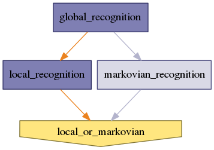

.. AUTO-GENERATED FILE -- DO NOT EDIT!

:orphan:

morphologist.capsul.axon.sulcilabellingspam.SulciLabellingSPAM
==============================================================

.. _morphologist.capsul.axon.sulcilabellingspam.SulciLabellingSPAM:

SulciLabellingSPAM
------------------

.. currentmodule:: morphologist.capsul.axon.sulcilabellingspam

.. note::

    * Type 'SulciLabellingSPAM.help()' for a full description of this process parameters.
    * Type '<SulciLabellingSPAM>.get_input_spec()' for a full description of this process input trait types.
    * Type '<SulciLabellingSPAM>.get_output_spec()' for a full description of this process output trait types.

Inputs
~~~~~~

[Mandatory]

+-------------------------------------------------------------------------------+
| | **local_or_markovian**: a legal value (['Enum'] - mandatory)                |
| |     No description.                                                         |
+-------------------------------------------------------------------------------+
| | **global_recognition_labels_priors**: a file name (['File'] - mandatory)    |
| |     No description.                                                         |
+-------------------------------------------------------------------------------+
| | **nodes_activation**: a legal value (['ControllerTrait'] - mandatory)       |
| |     No description.                                                         |
+-------------------------------------------------------------------------------+
| | **global_recognition_labels_translation_map**: a file name (['File'] -      |
| |     mandatory)                                                              |
| |     No description.                                                         |
+-------------------------------------------------------------------------------+
| | **data_graph**: a file name (['File'] - mandatory)                          |
| |     No description.                                                         |
+-------------------------------------------------------------------------------+

[Optional]

+--------------------------------------------------------------------------------+
| | **markovian_recognition_model**: a file name (['File'] - optional)           |
| |     No description.                                                          |
+--------------------------------------------------------------------------------+
| | **markovian_recognition_segments_relations_model**: a file name (['File']    |
| |     - optional)                                                              |
| |     No description.                                                          |
+--------------------------------------------------------------------------------+
| | **local_recognition_local_referentials**: a file name (['File'] -            |
| |     optional)                                                                |
| |     No description.                                                          |
+--------------------------------------------------------------------------------+
| | **local_recognition_direction_priors**: a file name (['File'] - optional)    |
| |     No description.                                                          |
+--------------------------------------------------------------------------------+
| | **local_recognition_translation_priors**: a file name (['File'] -            |
| |     optional)                                                                |
| |     No description.                                                          |
+--------------------------------------------------------------------------------+
| | **local_recognition_model**: a file name (['File'] - optional)               |
| |     No description.                                                          |
+--------------------------------------------------------------------------------+
| | **global_recognition_initial_transformation**: a file name (['File'] -       |
| |     optional)                                                                |
| |     No description.                                                          |
+--------------------------------------------------------------------------------+
| | **global_recognition_model_type**: a legal value (['Enum'] - optional)       |
| |     No description.                                                          |
+--------------------------------------------------------------------------------+
| | **local_recognition_angle_priors**: a file name (['File'] - optional)        |
| |     No description.                                                          |
+--------------------------------------------------------------------------------+
| | **global_recognition_model**: a file name (['File'] - optional)              |
| |     No description.                                                          |
+--------------------------------------------------------------------------------+

Outputs
~~~~~~~

+-----------------------------------------------------------------------------+
| | **output_graph**: any value                                               |
| |     No description.                                                       |
+-----------------------------------------------------------------------------+
| | **global_recognition_output_t1_to_global_transformation**: a file name    |
| |     No description.                                                       |
+-----------------------------------------------------------------------------+
| | **global_recognition_output_transformation**: a file name                 |
| |     No description.                                                       |
+-----------------------------------------------------------------------------+
| | **local_recognition_posterior_probabilities**: a file name                |
| |     No description.                                                       |
+-----------------------------------------------------------------------------+
| | **global_recognition_posterior_probabilities**: a file name               |
| |     No description.                                                       |
+-----------------------------------------------------------------------------+
| | **markovian_recognition_posterior_probabilities**: a file name            |
| |     No description.                                                       |
+-----------------------------------------------------------------------------+
| | **local_recognition_output_local_transformations**: a directory name      |
| |     No description.                                                       |
+-----------------------------------------------------------------------------+

Pipeline schema
~~~~~~~~~~~~~~~

