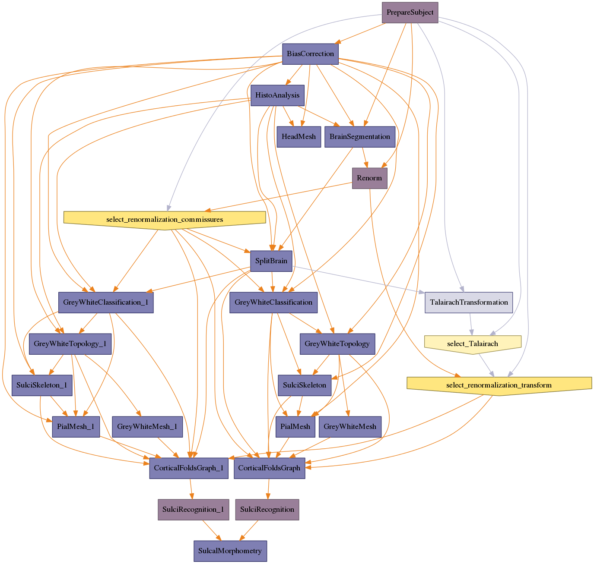

.. AUTO-GENERATED FILE -- DO NOT EDIT!

:orphan:

morphologist.capsul.morphologist.Morphologist
=============================================

.. _morphologist.capsul.morphologist.Morphologist:

Morphologist
------------

.. currentmodule:: morphologist.capsul.morphologist

.. note::

    * Type 'Morphologist.help()' for a full description of this process parameters.
    * Type '<Morphologist>.get_input_spec()' for a full description of this process input trait types.
    * Type '<Morphologist>.get_output_spec()' for a full description of this process output trait types.

Inputs
~~~~~~

[Mandatory]

+---------------------------------------------------------------------------------+
| | **compute_fold_meshes**: a boolean (['Bool'] - mandatory)                     |
| |     No description.                                                           |
+---------------------------------------------------------------------------------+
| | **CorticalFoldsGraph_graph_version**: a legal value (['Enum'] - mandatory)    |
| |     No description.                                                           |
+---------------------------------------------------------------------------------+
| | **t1mri**: a file name (['File'] - mandatory)                                 |
| |     No description.                                                           |
+---------------------------------------------------------------------------------+
| | **allow_multithreading**: a boolean (['Bool'] - mandatory)                    |
| |     No description.                                                           |
+---------------------------------------------------------------------------------+
| | **sulcal_morphometry_sulci_file**: a file name (['File'] - mandatory)         |
| |     No description.                                                           |
+---------------------------------------------------------------------------------+
| | **select_Talairach**: a legal value (['Enum'] - mandatory)                    |
| |     No description.                                                           |
+---------------------------------------------------------------------------------+
| | **normalization_allow_retry_initialization**: a boolean (['Bool'] -           |
| |     mandatory)                                                                |
| |     No description.                                                           |
+---------------------------------------------------------------------------------+
| | **perform_skull_stripped_renormalization**: a legal value (['Enum'] -         |
| |     mandatory)                                                                |
| |     No description.                                                           |
+---------------------------------------------------------------------------------+
| | **fix_random_seed**: a boolean (['Bool'] - mandatory)                         |
| |     No description.                                                           |
+---------------------------------------------------------------------------------+
| | **nodes_activation**: a legal value (['ControllerTrait'] - mandatory)         |
| |     No description.                                                           |
+---------------------------------------------------------------------------------+
| | **CorticalFoldsGraph_write_cortex_mid_interface**: a boolean (['Bool'] -      |
| |     mandatory)                                                                |
| |     No description.                                                           |
+---------------------------------------------------------------------------------+
| | **pipeline_steps**: a legal value (['ControllerTrait'] - mandatory)           |
| |     Steps are groups of pipeline nodes, which may be disabled at              |
| |     runtime. They are normally defined in a logical order regarding           |
| |     the workflow streams. They are different from sub-pipelines in            |
| |     that steps are purely virtual groups, they do not have parameters.        |
| |     To activate or diasable a step, just do:                                  |
| |     pipeline.steps.my_step = False                                            |
| |     To get the nodes list in a step:                                          |
| |     pipeline.get_step_nodes("my_step")                                        |
+---------------------------------------------------------------------------------+
| | **cortical_graph_version**: a legal value (['Enum'] - mandatory)              |
| |     No description.                                                           |
+---------------------------------------------------------------------------------+
| | **allow_flip_initial_MRI**: a boolean (['Bool'] - mandatory)                  |
| |     No description.                                                           |
+---------------------------------------------------------------------------------+

[Optional]

+-------------------------------------------------------------------------------------------------------+
| | **SulciRecognition_1_recognition2000_stopRate**: a float (['Float'] -                               |
| |     optional)                                                                                       |
| |     No description.                                                                                 |
+-------------------------------------------------------------------------------------------------------+
| | **PrepareSubject_Normalization_NormalizeSPM_ConvertSPMnormalizationToAIMS_target**: a               |
| |      legal value (['Enum'] - optional)                                                              |
| |     No description.                                                                                 |
+-------------------------------------------------------------------------------------------------------+
| | **PrepareSubject_Normalization_NormalizeFSL_NormalizeFSL_init_translation_origin**: a               |
| |      legal value (['Enum'] - optional)                                                              |
| |     No description.                                                                                 |
+-------------------------------------------------------------------------------------------------------+
| | **SulciRecognition_1_recognition2000_niterBelowStopProp**: an integer                               |
| |     (['Int'] - optional)                                                                            |
| |     No description.                                                                                 |
+-------------------------------------------------------------------------------------------------------+
| | **SulciRecognition_recognition2000_stopRate**: a float (['Float'] -                                 |
| |     optional)                                                                                       |
| |     No description.                                                                                 |
+-------------------------------------------------------------------------------------------------------+
| | **BiasCorrection_mode**: a legal value (['Enum'] - optional)                                        |
| |     No description.                                                                                 |
+-------------------------------------------------------------------------------------------------------+
| | **PialMesh_1_version**: a legal value (['Enum'] - optional)                                         |
| |     No description.                                                                                 |
+-------------------------------------------------------------------------------------------------------+
| | **HeadMesh_keep_head_mask**: a boolean (['Bool'] - optional)                                        |
| |     No description.                                                                                 |
+-------------------------------------------------------------------------------------------------------+
| | **SulciSkeleton_1_version**: a legal value (['Enum'] - optional)                                    |
| |     No description.                                                                                 |
+-------------------------------------------------------------------------------------------------------+
| | **Renorm_Normalization_NormalizeSPM_ConvertSPMnormalizationToAIMS_target**: a                       |
| |      legal value (['Enum'] - optional)                                                              |
| |     No description.                                                                                 |
+-------------------------------------------------------------------------------------------------------+
| | **PrepareSubject_StandardACPC_Normalised**: a legal value (['Enum'] -                               |
| |     optional)                                                                                       |
| |     No description.                                                                                 |
+-------------------------------------------------------------------------------------------------------+
| | **BiasCorrection_delete_last_n_slices**: a string (['Str'] - optional)                              |
| |     No description.                                                                                 |
+-------------------------------------------------------------------------------------------------------+
| | **SulciRecognition_1_recognition2000_rate**: a float (['Float'] -                                   |
| |     optional)                                                                                       |
| |     No description.                                                                                 |
+-------------------------------------------------------------------------------------------------------+
| | **SulciRecognition_1_SPAM_recognition09_global_recognition_model_type**: a                          |
| |     legal value (['Enum'] - optional)                                                               |
| |     No description.                                                                                 |
+-------------------------------------------------------------------------------------------------------+
| | **SulciRecognition_1_SPAM_recognition09_markovian_recognition_segments_relations_model**: a         |
| |      file name (['File'] - optional)                                                                |
| |     No description.                                                                                 |
+-------------------------------------------------------------------------------------------------------+
| | **PrepareSubject_TalairachFromNormalization_source_referential**: a file                            |
| |     name (['File'] - optional)                                                                      |
| |     No description.                                                                                 |
+-------------------------------------------------------------------------------------------------------+
| | **SulciRecognition_1_recognition2000_model**: a file name (['File'] -                               |
| |     optional)                                                                                       |
| |     No description.                                                                                 |
+-------------------------------------------------------------------------------------------------------+
| | **BiasCorrection_field_rigidity**: a float (['Float'] - optional)                                   |
| |     No description.                                                                                 |
+-------------------------------------------------------------------------------------------------------+
| | **SulciRecognition_1_SPAM_recognition09_local_or_markovian**: a legal                               |
| |     value (['Enum'] - optional)                                                                     |
| |     No description.                                                                                 |
+-------------------------------------------------------------------------------------------------------+
| | **BiasCorrection_write_field**: a legal value (['Enum'] - optional)                                 |
| |     No description.                                                                                 |
+-------------------------------------------------------------------------------------------------------+
| | **Renorm_Normalization_NormalizeSPM_NormalizeSPM_nbiteration**: an integer                          |
| |     (['Int'] - optional)                                                                            |
| |     No description.                                                                                 |
+-------------------------------------------------------------------------------------------------------+
| | **HistoAnalysis_use_wridges**: a boolean (['Bool'] - optional)                                      |
| |     No description.                                                                                 |
+-------------------------------------------------------------------------------------------------------+
| | **PrepareSubject_Normalization_NormalizeSPM_NormalizeSPM_nbiteration**: an                          |
| |     integer (['Int'] - optional)                                                                    |
| |     No description.                                                                                 |
+-------------------------------------------------------------------------------------------------------+
| | **GreyWhiteTopology_1_version**: a legal value (['Enum'] - optional)                                |
| |     No description.                                                                                 |
+-------------------------------------------------------------------------------------------------------+
| | **SulcalMorphometry_use_attribute**: a legal value (['Enum'] - optional)                            |
| |     No description.                                                                                 |
+-------------------------------------------------------------------------------------------------------+
| | **SulciRecognition_SPAM_recognition09_markovian_recognition_model**: a                              |
| |     file name (['File'] - optional)                                                                 |
| |     No description.                                                                                 |
+-------------------------------------------------------------------------------------------------------+
| | **BiasCorrection_use_existing_ridges**: a boolean (['Bool'] - optional)                             |
| |     No description.                                                                                 |
+-------------------------------------------------------------------------------------------------------+
| | **Renorm_Normalization_NormalizeSPM_NormalizeSPM_cutoff_option**: an                                |
| |     integer (['Int'] - optional)                                                                    |
| |     No description.                                                                                 |
+-------------------------------------------------------------------------------------------------------+
| | **PrepareSubject_Normalization_NormalizeSPM_NormalizeSPM_voxel_size**: a l                          |
| |     egal value (['Enum'] - optional)                                                                |
| |     No description.                                                                                 |
+-------------------------------------------------------------------------------------------------------+
| | **SulciRecognition_1_SPAM_recognition09_markovian_recognition_model**: a f                          |
| |     ile name (['File'] - optional)                                                                  |
| |     No description.                                                                                 |
+-------------------------------------------------------------------------------------------------------+
| | **PrepareSubject_Normalization_Normalization_AimsMIRegister_smoothing**: a                          |
| |     float (['Float'] - optional)                                                                    |
| |     No description.                                                                                 |
+-------------------------------------------------------------------------------------------------------+
| | **SulciRecognition_1_recognition2000_model_hint**: a legal value (['Enum']                          |
| |     - optional)                                                                                     |
| |     No description.                                                                                 |
+-------------------------------------------------------------------------------------------------------+
| | **PrepareSubject_Normalization_NormalizeFSL_NormalizeFSL_search_cost_function**: a                  |
| |      legal value (['Enum'] - optional)                                                              |
| |     No description.                                                                                 |
+-------------------------------------------------------------------------------------------------------+
| | **Renorm_Normalization_NormalizeSPM_ConvertSPMnormalizationToAIMS_removeSource**: a                 |
| |      boolean (['Bool'] - optional)                                                                  |
| |     No description.                                                                                 |
+-------------------------------------------------------------------------------------------------------+
| | **HeadMesh_closing**: a float (['Float'] - optional)                                                |
| |     No description.                                                                                 |
+-------------------------------------------------------------------------------------------------------+
| | **SulciRecognition_SPAM_recognition09_global_recognition_model**: a file                            |
| |     name (['File'] - optional)                                                                      |
| |     No description.                                                                                 |
+-------------------------------------------------------------------------------------------------------+
| | **PrepareSubject_Normalization_Normalization_AimsMIRegister_mni_to_acpc**: a                        |
| |      file name (['File'] - optional)                                                                |
| |     No description.                                                                                 |
+-------------------------------------------------------------------------------------------------------+
| | **PrepareSubject_Normalization_NormalizeFSL_NormalizeFSL_cost_function**: a                         |
| |      legal value (['Enum'] - optional)                                                              |
| |     No description.                                                                                 |
+-------------------------------------------------------------------------------------------------------+
| | **PrepareSubject_Normalization_NormalizeSPM_NormalizeSPM_init_translation_origin**: a               |
| |      legal value (['Enum'] - optional)                                                              |
| |     No description.                                                                                 |
+-------------------------------------------------------------------------------------------------------+
| | **interhemispheric_point**: a legal value (['List_Float'] - optional)                               |
| |     No description.                                                                                 |
+-------------------------------------------------------------------------------------------------------+
| | **PrepareSubject_StandardACPC_remove_older_MNI_normalization**: a boolean                           |
| |     (['Bool'] - optional)                                                                           |
| |     No description.                                                                                 |
+-------------------------------------------------------------------------------------------------------+
| | **SulciRecognition_1_recognition2000_forbid_unknown_label**: a boolean                              |
| |     (['Bool'] - optional)                                                                           |
| |     No description.                                                                                 |
+-------------------------------------------------------------------------------------------------------+
| | **SplitBrain_variant**: a legal value (['Enum'] - optional)                                         |
| |     No description.                                                                                 |
+-------------------------------------------------------------------------------------------------------+
| | **SulciRecognition_SPAM_recognition09_global_recognition_labels_priors**: a                         |
| |      file name (['File'] - optional)                                                                |
| |     No description.                                                                                 |
+-------------------------------------------------------------------------------------------------------+
| | **SulciRecognition_SPAM_recognition09_global_recognition_initial_transformation**: a                |
| |      file name (['File'] - optional)                                                                |
| |     No description.                                                                                 |
+-------------------------------------------------------------------------------------------------------+
| | **SulciRecognition_1_SPAM_recognition09_local_recognition_model**: a file                           |
| |     name (['File'] - optional)                                                                      |
| |     No description.                                                                                 |
+-------------------------------------------------------------------------------------------------------+
| | **HeadMesh_remove_mask**: a file name (['File'] - optional)                                         |
| |     No description.                                                                                 |
+-------------------------------------------------------------------------------------------------------+
| | **PrepareSubject_Normalization_NormalizeFSL_ConvertFSLnormalizationToAIMS_standard_template**: a    |
| |      legal value (['Enum'] - optional)                                                              |
| |     No description.                                                                                 |
+-------------------------------------------------------------------------------------------------------+
| | **PrepareSubject_TalairachFromNormalization_transform_chain_ACPC_to_Normalized**: a                 |
| |      file name (['File'] - optional)                                                                |
| |     No description.                                                                                 |
+-------------------------------------------------------------------------------------------------------+
| | **Renorm_Normalization_NormalizeFSL_NormalizeFSL_search_cost_function**: a                          |
| |     legal value (['Enum'] - optional)                                                               |
| |     No description.                                                                                 |
+-------------------------------------------------------------------------------------------------------+
| | **SulciRecognition_SPAM_recognition09_markovian_recognition_segments_relations_model**: a           |
| |      file name (['File'] - optional)                                                                |
| |     No description.                                                                                 |
+-------------------------------------------------------------------------------------------------------+
| | **PrepareSubject_StandardACPC_older_MNI_normalization**: a file name                                |
| |     (['File'] - optional)                                                                           |
| |     No description.                                                                                 |
+-------------------------------------------------------------------------------------------------------+
| | **Renorm_Normalization_NormalizeFSL_NormalizeFSL_init_translation_origin**: a                       |
| |      legal value (['Enum'] - optional)                                                              |
| |     No description.                                                                                 |
+-------------------------------------------------------------------------------------------------------+
| | **SulciRecognition_SPAM_recognition09_local_recognition_model**: a file                             |
| |     name (['File'] - optional)                                                                      |
| |     No description.                                                                                 |
+-------------------------------------------------------------------------------------------------------+
| | **BrainSegmentation_visu**: a legal value (['Enum'] - optional)                                     |
| |     No description.                                                                                 |
+-------------------------------------------------------------------------------------------------------+
| | **Renorm_Normalization_NormalizeBaladin_set_transformation_in_source_volume**: a                    |
| |      boolean (['Bool'] - optional)                                                                  |
| |     No description.                                                                                 |
+-------------------------------------------------------------------------------------------------------+
| | **Renorm_Normalization_NormalizeFSL_alignment**: a legal value (['Enum'] -                          |
| |     optional)                                                                                       |
| |     No description.                                                                                 |
+-------------------------------------------------------------------------------------------------------+
| | **BiasCorrection_write_variance**: a legal value (['Enum'] - optional)                              |
| |     No description.                                                                                 |
+-------------------------------------------------------------------------------------------------------+
| | **Renorm_Normalization_Normalization_AimsMIRegister_smoothing**: a float (                          |
| |     ['Float'] - optional)                                                                           |
| |     No description.                                                                                 |
+-------------------------------------------------------------------------------------------------------+
| | **SulciRecognition_SPAM_recognition09_local_or_markovian**: a legal value                           |
| |     (['Enum'] - optional)                                                                           |
| |     No description.                                                                                 |
+-------------------------------------------------------------------------------------------------------+
| | **SulciRecognition_recognition2000_model**: a file name (['File'] -                                 |
| |     optional)                                                                                       |
| |     No description.                                                                                 |
+-------------------------------------------------------------------------------------------------------+
| | **PrepareSubject_Normalization_NormalizeFSL_set_transformation_in_source_volume**: a                |
| |      boolean (['Bool'] - optional)                                                                  |
| |     No description.                                                                                 |
+-------------------------------------------------------------------------------------------------------+
| | **HeadMesh_threshold**: an integer (['Int'] - optional)                                             |
| |     No description.                                                                                 |
+-------------------------------------------------------------------------------------------------------+
| | **SulciRecognition_SPAM_recognition09_local_recognition_angle_priors**: a                           |
| |     file name (['File'] - optional)                                                                 |
| |     No description.                                                                                 |
+-------------------------------------------------------------------------------------------------------+
| | **BiasCorrection_modality**: a legal value (['Enum'] - optional)                                    |
| |     No description.                                                                                 |
+-------------------------------------------------------------------------------------------------------+
| | **PrepareSubject_Normalization_NormalizeFSL_alignment**: a legal value                              |
| |     (['Enum'] - optional)                                                                           |
| |     No description.                                                                                 |
+-------------------------------------------------------------------------------------------------------+
| | **SulciRecognition_SPAM_recognition09_global_recognition_model_type**: a l                          |
| |     egal value (['Enum'] - optional)                                                                |
| |     No description.                                                                                 |
+-------------------------------------------------------------------------------------------------------+
| | **Renorm_Normalization_NormalizeSPM_NormalizeSPM_voxel_size**: a legal                              |
| |     value (['Enum'] - optional)                                                                     |
| |     No description.                                                                                 |
+-------------------------------------------------------------------------------------------------------+
| | **SplitBrain_initial_erosion**: a float (['Float'] - optional)                                      |
| |     No description.                                                                                 |
+-------------------------------------------------------------------------------------------------------+
| | **PrepareSubject_Normalization_NormalizeSPM_template**: a file name                                 |
| |     (['File'] - optional)                                                                           |
| |     No description.                                                                                 |
+-------------------------------------------------------------------------------------------------------+
| | **SulciRecognition_SPAM_recognition09_local_recognition_local_referentials**: a                     |
| |      file name (['File'] - optional)                                                                |
| |     No description.                                                                                 |
+-------------------------------------------------------------------------------------------------------+
| | **SulciRecognition_1_SPAM_recognition09_local_recognition_angle_priors**: a                         |
| |      file name (['File'] - optional)                                                                |
| |     No description.                                                                                 |
+-------------------------------------------------------------------------------------------------------+
| | **SplitBrain_split_template**: a file name (['File'] - optional)                                    |
| |     No description.                                                                                 |
+-------------------------------------------------------------------------------------------------------+
| | **BiasCorrection_write_edges**: a legal value (['Enum'] - optional)                                 |
| |     No description.                                                                                 |
+-------------------------------------------------------------------------------------------------------+
| | **SulciSkeleton_version**: a legal value (['Enum'] - optional)                                      |
| |     No description.                                                                                 |
+-------------------------------------------------------------------------------------------------------+
| | **SulciRecognition_SPAM_recognition09_local_recognition_direction_priors**: a                       |
| |      file name (['File'] - optional)                                                                |
| |     No description.                                                                                 |
+-------------------------------------------------------------------------------------------------------+
| | **PialMesh_version**: a legal value (['Enum'] - optional)                                           |
| |     No description.                                                                                 |
+-------------------------------------------------------------------------------------------------------+
| | **SulciRecognition_1_select_Sulci_Recognition**: a legal value (['Enum'] -                          |
| |     optional)                                                                                       |
| |     No description.                                                                                 |
+-------------------------------------------------------------------------------------------------------+
| | **SulciRecognition_1_SPAM_recognition09_local_recognition_local_referentials**: a                   |
| |      file name (['File'] - optional)                                                                |
| |     No description.                                                                                 |
+-------------------------------------------------------------------------------------------------------+
| | **SulciRecognition_1_SPAM_recognition09_global_recognition_labels_priors**: a                       |
| |      file name (['File'] - optional)                                                                |
| |     No description.                                                                                 |
+-------------------------------------------------------------------------------------------------------+
| | **PrepareSubject_Normalization_NormalizeSPM_ConvertSPMnormalizationToAIMS_normalized_volume**: a    |
| |      file name (['File'] - optional)                                                                |
| |     No description.                                                                                 |
+-------------------------------------------------------------------------------------------------------+
| | **BrainSegmentation_erosion_size**: a float (['Float'] - optional)                                  |
| |     No description.                                                                                 |
+-------------------------------------------------------------------------------------------------------+
| | **SplitBrain_bary_factor**: a legal value (['Enum'] - optional)                                     |
| |     No description.                                                                                 |
+-------------------------------------------------------------------------------------------------------+
| | **SulciRecognition_select_Sulci_Recognition**: a legal value (['Enum'] -                            |
| |     optional)                                                                                       |
| |     No description.                                                                                 |
+-------------------------------------------------------------------------------------------------------+
| | **Normalization_select_Normalization_pipeline**: a legal value (['Enum'] -                          |
| |     optional)                                                                                       |
| |     No description.                                                                                 |
+-------------------------------------------------------------------------------------------------------+
| | **BiasCorrection_variance_fraction**: an integer (['Int'] - optional)                               |
| |     No description.                                                                                 |
+-------------------------------------------------------------------------------------------------------+
| | **HistoAnalysis_undersampling**: a legal value (['Enum'] - optional)                                |
| |     No description.                                                                                 |
+-------------------------------------------------------------------------------------------------------+
| | **SulciRecognition_1_SPAM_recognition09_local_recognition_direction_priors**: a                     |
| |      file name (['File'] - optional)                                                                |
| |     No description.                                                                                 |
+-------------------------------------------------------------------------------------------------------+
| | **BrainSegmentation_lesion_mask**: a file name (['File'] - optional)                                |
| |     No description.                                                                                 |
+-------------------------------------------------------------------------------------------------------+
| | **SplitBrain_mode**: a legal value (['Enum'] - optional)                                            |
| |     No description.                                                                                 |
+-------------------------------------------------------------------------------------------------------+
| | **BiasCorrection_zdir_multiply_regul**: a float (['Float'] - optional)                              |
| |     No description.                                                                                 |
+-------------------------------------------------------------------------------------------------------+
| | **GreyWhiteTopology_version**: a legal value (['Enum'] - optional)                                  |
| |     No description.                                                                                 |
+-------------------------------------------------------------------------------------------------------+
| | **Renorm_Normalization_NormalizeFSL_ConvertFSLnormalizationToAIMS_standard_template**: a            |
| |      legal value (['Enum'] - optional)                                                              |
| |     No description.                                                                                 |
+-------------------------------------------------------------------------------------------------------+
| | **PrepareSubject_Normalization_commissures_coordinates**: a file name                               |
| |     (['File'] - optional)                                                                           |
| |     No description.                                                                                 |
+-------------------------------------------------------------------------------------------------------+
| | **BrainSegmentation_first_slice**: an integer (['Int'] - optional)                                  |
| |     No description.                                                                                 |
+-------------------------------------------------------------------------------------------------------+
| | **SulciRecognition_1_SPAM_recognition09_local_recognition_translation_priors**: a                   |
| |      file name (['File'] - optional)                                                                |
| |     No description.                                                                                 |
+-------------------------------------------------------------------------------------------------------+
| | **Renorm_Normalization_Normalization_AimsMIRegister_mni_to_acpc**: a file                           |
| |     name (['File'] - optional)                                                                      |
| |     No description.                                                                                 |
+-------------------------------------------------------------------------------------------------------+
| | **BiasCorrection_ngrid**: an integer (['Int'] - optional)                                           |
| |     No description.                                                                                 |
+-------------------------------------------------------------------------------------------------------+
| | **PrepareSubject_Normalization_NormalizeFSL_template**: a file name                                 |
| |     (['File'] - optional)                                                                           |
| |     No description.                                                                                 |
+-------------------------------------------------------------------------------------------------------+
| | **BiasCorrection_edge_mask**: a legal value (['Enum'] - optional)                                   |
| |     No description.                                                                                 |
+-------------------------------------------------------------------------------------------------------+
| | **Renorm_Normalization_NormalizeSPM_ConvertSPMnormalizationToAIMS_normalized_volume**: a            |
| |      file name (['File'] - optional)                                                                |
| |     No description.                                                                                 |
+-------------------------------------------------------------------------------------------------------+
| | **BiasCorrection_write_hfiltered**: a legal value (['Enum'] - optional)                             |
| |     No description.                                                                                 |
+-------------------------------------------------------------------------------------------------------+
| | **PrepareSubject_Normalization_NormalizeSPM_NormalizeSPM_cutoff_option**: a                         |
| |     n integer (['Int'] - optional)                                                                  |
| |     No description.                                                                                 |
+-------------------------------------------------------------------------------------------------------+
| | **BiasCorrection_write_wridges**: a legal value (['Enum'] - optional)                               |
| |     No description.                                                                                 |
+-------------------------------------------------------------------------------------------------------+
| | **SulciRecognition_recognition2000_rate**: a float (['Float'] - optional)                           |
| |     No description.                                                                                 |
+-------------------------------------------------------------------------------------------------------+
| | **BrainSegmentation_last_slice**: an integer (['Int'] - optional)                                   |
| |     No description.                                                                                 |
+-------------------------------------------------------------------------------------------------------+
| | **left_hemisphere_point**: a legal value (['List_Float'] - optional)                                |
| |     No description.                                                                                 |
+-------------------------------------------------------------------------------------------------------+
| | **BrainSegmentation_layer**: a legal value (['Enum'] - optional)                                    |
| |     No description.                                                                                 |
+-------------------------------------------------------------------------------------------------------+
| | **SulciRecognition_SPAM_recognition09_local_recognition_translation_priors**: a                     |
| |      file name (['File'] - optional)                                                                |
| |     No description.                                                                                 |
+-------------------------------------------------------------------------------------------------------+
| | **Renorm_template**: a file name (['File'] - optional)                                              |
| |     No description.                                                                                 |
+-------------------------------------------------------------------------------------------------------+
| | **SulciRecognition_1_SPAM_recognition09_global_recognition_initial_transformation**: a              |
| |      file name (['File'] - optional)                                                                |
| |     No description.                                                                                 |
+-------------------------------------------------------------------------------------------------------+
| | **BrainSegmentation_variant**: a legal value (['Enum'] - optional)                                  |
| |     No description.                                                                                 |
+-------------------------------------------------------------------------------------------------------+
| | **BiasCorrection_write_meancurvature**: a legal value (['Enum'] -                                   |
| |     optional)                                                                                       |
| |     No description.                                                                                 |
+-------------------------------------------------------------------------------------------------------+
| | **SulciRecognition_recognition2000_model_hint**: a legal value (['Enum'] -                          |
| |     optional)                                                                                       |
| |     No description.                                                                                 |
+-------------------------------------------------------------------------------------------------------+
| | **SulciRecognition_recognition2000_niterBelowStopProp**: an integer                                 |
| |     (['Int'] - optional)                                                                            |
| |     No description.                                                                                 |
+-------------------------------------------------------------------------------------------------------+
| | **Renorm_Normalization_NormalizeFSL_NormalizeFSL_cost_function**: a legal                           |
| |     value (['Enum'] - optional)                                                                     |
| |     No description.                                                                                 |
+-------------------------------------------------------------------------------------------------------+
| | **SplitBrain_cc_min_size**: an integer (['Int'] - optional)                                         |
| |     No description.                                                                                 |
+-------------------------------------------------------------------------------------------------------+
| | **Renorm_Normalization_NormalizeFSL_set_transformation_in_source_volume**: a                        |
| |      boolean (['Bool'] - optional)                                                                  |
| |     No description.                                                                                 |
+-------------------------------------------------------------------------------------------------------+
| | **Renorm_Normalization_NormalizeSPM_NormalizeSPM_init_translation_origin**: a                       |
| |      legal value (['Enum'] - optional)                                                              |
| |     No description.                                                                                 |
+-------------------------------------------------------------------------------------------------------+
| | **PrepareSubject_Normalization_Normalization_AimsMIRegister_anatomical_template**: a                |
| |      file name (['File'] - optional)                                                                |
| |     No description.                                                                                 |
+-------------------------------------------------------------------------------------------------------+
| | **PrepareSubject_TalairachFromNormalization_normalized_referential**: a                             |
| |     file name (['File'] - optional)                                                                 |
| |     No description.                                                                                 |
+-------------------------------------------------------------------------------------------------------+
| | **SulciRecognition_recognition2000_forbid_unknown_label**: a boolean                                |
| |     (['Bool'] - optional)                                                                           |
| |     No description.                                                                                 |
+-------------------------------------------------------------------------------------------------------+
| | **HeadMesh_first_slice**: an integer (['Int'] - optional)                                           |
| |     No description.                                                                                 |
+-------------------------------------------------------------------------------------------------------+
| | **SplitBrain_use_ridges**: a boolean (['Bool'] - optional)                                          |
| |     No description.                                                                                 |
+-------------------------------------------------------------------------------------------------------+
| | **PrepareSubject_Normalization_NormalizeBaladin_set_transformation_in_source_volume**: a            |
| |      boolean (['Bool'] - optional)                                                                  |
| |     No description.                                                                                 |
+-------------------------------------------------------------------------------------------------------+
| | **SulciRecognition_1_SPAM_recognition09_global_recognition_model**: a file                          |
| |     name (['File'] - optional)                                                                      |
| |     No description.                                                                                 |
+-------------------------------------------------------------------------------------------------------+
| | **posterior_commissure**: a legal value (['List_Float'] - optional)                                 |
| |     No description.                                                                                 |
+-------------------------------------------------------------------------------------------------------+
| | **BiasCorrection_sampling**: a float (['Float'] - optional)                                         |
| |     No description.                                                                                 |
+-------------------------------------------------------------------------------------------------------+
| | **SPAM_recognition_labels_translation_map**: a file name (['File'] -                                |
| |     optional)                                                                                       |
| |     No description.                                                                                 |
+-------------------------------------------------------------------------------------------------------+
| | **SplitBrain_use_template**: a boolean (['Bool'] - optional)                                        |
| |     No description.                                                                                 |
+-------------------------------------------------------------------------------------------------------+
| | **PrepareSubject_Normalization_NormalizeBaladin_template**: a file name                             |
| |     (['File'] - optional)                                                                           |
| |     No description.                                                                                 |
+-------------------------------------------------------------------------------------------------------+
| | **HistoAnalysis_use_hfiltered**: a boolean (['Bool'] - optional)                                    |
| |     No description.                                                                                 |
+-------------------------------------------------------------------------------------------------------+
| | **PrepareSubject_Normalization_NormalizeSPM_ConvertSPMnormalizationToAIMS_removeSource**: a         |
| |      boolean (['Bool'] - optional)                                                                  |
| |     No description.                                                                                 |
+-------------------------------------------------------------------------------------------------------+
| | **PrepareSubject_TalairachFromNormalization_acpc_referential**: a file                              |
| |     name (['File'] - optional)                                                                      |
| |     No description.                                                                                 |
+-------------------------------------------------------------------------------------------------------+
| | **anterior_commissure**: a legal value (['List_Float'] - optional)                                  |
| |     No description.                                                                                 |
+-------------------------------------------------------------------------------------------------------+
| | **BiasCorrection_wridges_weight**: a float (['Float'] - optional)                                   |
| |     No description.                                                                                 |
+-------------------------------------------------------------------------------------------------------+

Outputs
~~~~~~~

+---------------------------------------------------------------------------------------------------------+
| | **SulciSkeleton_1_roots**: a file name                                                                |
| |     No description.                                                                                   |
+---------------------------------------------------------------------------------------------------------+
| | **BiasCorrection_white_ridges**: a file name                                                          |
| |     No description.                                                                                   |
+---------------------------------------------------------------------------------------------------------+
| | **Renorm_skull_stripped**: a file name                                                                |
| |     No description.                                                                                   |
+---------------------------------------------------------------------------------------------------------+
| | **left_graph**: a file name                                                                           |
| |     No description.                                                                                   |
+---------------------------------------------------------------------------------------------------------+
| | **SulciRecognition_1_recognition2000_energy_plot_file**: a file name                                  |
| |     No description.                                                                                   |
+---------------------------------------------------------------------------------------------------------+
| | **SulciSkeleton_skeleton**: a file name                                                               |
| |     No description.                                                                                   |
+---------------------------------------------------------------------------------------------------------+
| | **commissure_coordinates**: any value                                                                 |
| |     No description.                                                                                   |
+---------------------------------------------------------------------------------------------------------+
| | **SulciRecognition_SPAM_recognition09_markovian_recognition_posterior_probabilities**: a              |
| |      file name                                                                                        |
| |     No description.                                                                                   |
+---------------------------------------------------------------------------------------------------------+
| | **SulciRecognition_SPAM_recognition09_global_recognition_output_t1_to_global_transformation**: a      |
| |      file name                                                                                        |
| |     No description.                                                                                   |
+---------------------------------------------------------------------------------------------------------+
| | **GreyWhiteClassification_1_grey_white**: a file name                                                 |
| |     No description.                                                                                   |
+---------------------------------------------------------------------------------------------------------+
| | **BiasCorrection_edges**: a file name                                                                 |
| |     No description.                                                                                   |
+---------------------------------------------------------------------------------------------------------+
| | **BiasCorrection_meancurvature**: a file name                                                         |
| |     No description.                                                                                   |
+---------------------------------------------------------------------------------------------------------+
| | **CorticalFoldsGraph_sulci_voronoi**: a file name                                                     |
| |     No description.                                                                                   |
+---------------------------------------------------------------------------------------------------------+
| | **BiasCorrection_field**: a file name                                                                 |
| |     No description.                                                                                   |
+---------------------------------------------------------------------------------------------------------+
| | **normalization_baladin_native_transformation_pass1**: a file name                                    |
| |     No description.                                                                                   |
+---------------------------------------------------------------------------------------------------------+
| | **MNI_transform**: any value                                                                          |
| |     No description.                                                                                   |
+---------------------------------------------------------------------------------------------------------+
| | **SulciRecognition_SPAM_recognition09_local_recognition_output_local_transformations**: a             |
| |      directory name                                                                                   |
| |     No description.                                                                                   |
+---------------------------------------------------------------------------------------------------------+
| | **normalization_baladin_native_transformation**: a file name                                          |
| |     No description.                                                                                   |
+---------------------------------------------------------------------------------------------------------+
| | **normalization_spm_native_transformation**: a file name                                              |
| |     No description.                                                                                   |
+---------------------------------------------------------------------------------------------------------+
| | **GreyWhiteMesh_white_mesh**: a file name                                                             |
| |     No description.                                                                                   |
+---------------------------------------------------------------------------------------------------------+
| | **sulcal_morpho_measures**: a file name                                                               |
| |     No description.                                                                                   |
+---------------------------------------------------------------------------------------------------------+
| | **CorticalFoldsGraph_cortex_mid_interface**: a file name                                              |
| |     No description.                                                                                   |
+---------------------------------------------------------------------------------------------------------+
| | **split_brain**: a file name                                                                          |
| |     No description.                                                                                   |
+---------------------------------------------------------------------------------------------------------+
| | **BiasCorrection_hfiltered**: a file name                                                             |
| |     No description.                                                                                   |
+---------------------------------------------------------------------------------------------------------+
| | **normalization_fsl_native_transformation**: a file name                                              |
| |     No description.                                                                                   |
+---------------------------------------------------------------------------------------------------------+
| | **CorticalFoldsGraph_1_cortex_mid_interface**: a file name                                            |
| |     No description.                                                                                   |
+---------------------------------------------------------------------------------------------------------+
| | **SulciSkeleton_roots**: a file name                                                                  |
| |     No description.                                                                                   |
+---------------------------------------------------------------------------------------------------------+
| | **normalization_spm_native_transformation_pass1**: a file name                                        |
| |     No description.                                                                                   |
+---------------------------------------------------------------------------------------------------------+
| | **SulciRecognition_recognition2000_energy_plot_file**: a file name                                    |
| |     No description.                                                                                   |
+---------------------------------------------------------------------------------------------------------+
| | **normalization_spm_native_job_file_pass1**: a file name                                              |
| |     No description.                                                                                   |
+---------------------------------------------------------------------------------------------------------+
| | **HistoAnalysis_histo**: a file name                                                                  |
| |     No description.                                                                                   |
+---------------------------------------------------------------------------------------------------------+
| | **GreyWhiteTopology_1_hemi_cortex**: a file name                                                      |
| |     No description.                                                                                   |
+---------------------------------------------------------------------------------------------------------+
| | **SulciRecognition_1_SPAM_recognition09_global_recognition_posterior_probabilities**: a               |
| |      file name                                                                                        |
| |     No description.                                                                                   |
+---------------------------------------------------------------------------------------------------------+
| | **normalization_spm_native_job_file**: a file name                                                    |
| |     No description.                                                                                   |
+---------------------------------------------------------------------------------------------------------+
| | **SulciRecognition_1_SPAM_recognition09_local_recognition_posterior_probabilities**: a                |
| |      file name                                                                                        |
| |     No description.                                                                                   |
+---------------------------------------------------------------------------------------------------------+
| | **SulciRecognition_SPAM_recognition09_global_recognition_output_transformation**: a                   |
| |      file name                                                                                        |
| |     No description.                                                                                   |
+---------------------------------------------------------------------------------------------------------+
| | **PialMesh_pial_mesh**: a file name                                                                   |
| |     No description.                                                                                   |
+---------------------------------------------------------------------------------------------------------+
| | **GreyWhiteClassification_grey_white**: a file name                                                   |
| |     No description.                                                                                   |
+---------------------------------------------------------------------------------------------------------+
| | **GreyWhiteTopology_hemi_cortex**: a file name                                                        |
| |     No description.                                                                                   |
+---------------------------------------------------------------------------------------------------------+
| | **normalized_t1mri**: any value                                                                       |
| |     No description.                                                                                   |
+---------------------------------------------------------------------------------------------------------+
| | **PialMesh_1_pial_mesh**: a file name                                                                 |
| |     No description.                                                                                   |
+---------------------------------------------------------------------------------------------------------+
| | **SulciRecognition_1_SPAM_recognition09_global_recognition_output_t1_to_global_transformation**: a    |
| |      file name                                                                                        |
| |     No description.                                                                                   |
+---------------------------------------------------------------------------------------------------------+
| | **right_graph**: a file name                                                                          |
| |     No description.                                                                                   |
+---------------------------------------------------------------------------------------------------------+
| | **SulciRecognition_SPAM_recognition09_local_recognition_posterior_probabilities**: a                  |
| |      file name                                                                                        |
| |     No description.                                                                                   |
+---------------------------------------------------------------------------------------------------------+
| | **left_labelled_graph**: any value                                                                    |
| |     No description.                                                                                   |
+---------------------------------------------------------------------------------------------------------+
| | **SulciRecognition_1_SPAM_recognition09_global_recognition_output_transformation**: a                 |
| |      file name                                                                                        |
| |     No description.                                                                                   |
+---------------------------------------------------------------------------------------------------------+
| | **right_labelled_graph**: any value                                                                   |
| |     No description.                                                                                   |
+---------------------------------------------------------------------------------------------------------+
| | **BiasCorrection_variance**: a file name                                                              |
| |     No description.                                                                                   |
+---------------------------------------------------------------------------------------------------------+
| | **SulciRecognition_SPAM_recognition09_global_recognition_posterior_probabilities**: a                 |
| |      file name                                                                                        |
| |     No description.                                                                                   |
+---------------------------------------------------------------------------------------------------------+
| | **BrainSegmentation_brain_mask**: a file name                                                         |
| |     No description.                                                                                   |
+---------------------------------------------------------------------------------------------------------+
| | **SulciRecognition_1_SPAM_recognition09_local_recognition_output_local_transformations**: a           |
| |      directory name                                                                                   |
| |     No description.                                                                                   |
+---------------------------------------------------------------------------------------------------------+
| | **t1mri_nobias**: a file name                                                                         |
| |     No description.                                                                                   |
+---------------------------------------------------------------------------------------------------------+
| | **SulciRecognition_1_SPAM_recognition09_markovian_recognition_posterior_probabilities**: a            |
| |      file name                                                                                        |
| |     No description.                                                                                   |
+---------------------------------------------------------------------------------------------------------+
| | **reoriented_t1mri**: any value                                                                       |
| |     No description.                                                                                   |
+---------------------------------------------------------------------------------------------------------+
| | **SulciSkeleton_1_skeleton**: a file name                                                             |
| |     No description.                                                                                   |
+---------------------------------------------------------------------------------------------------------+
| | **CorticalFoldsGraph_1_sulci_voronoi**: a file name                                                   |
| |     No description.                                                                                   |
+---------------------------------------------------------------------------------------------------------+
| | **HeadMesh_head_mesh**: a file name                                                                   |
| |     No description.                                                                                   |
+---------------------------------------------------------------------------------------------------------+
| | **Talairach_transform**: any value                                                                    |
| |     No description.                                                                                   |
+---------------------------------------------------------------------------------------------------------+
| | **normalization_fsl_native_transformation_pass1**: a file name                                        |
| |     No description.                                                                                   |
+---------------------------------------------------------------------------------------------------------+
| | **GreyWhiteMesh_1_white_mesh**: a file name                                                           |
| |     No description.                                                                                   |
+---------------------------------------------------------------------------------------------------------+
| | **histo_analysis**: a file name                                                                       |
| |     No description.                                                                                   |
+---------------------------------------------------------------------------------------------------------+
| | **HeadMesh_head_mask**: a file name                                                                   |
| |     No description.                                                                                   |
+---------------------------------------------------------------------------------------------------------+

Pipeline schema
~~~~~~~~~~~~~~~

