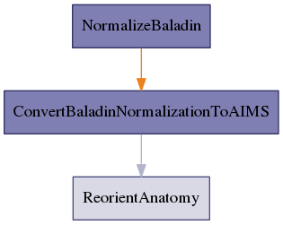

.. AUTO-GENERATED FILE -- DO NOT EDIT!

:orphan:

morphologist.capsul.axon.baladinnormalizationpipeline.BaladinNormalizationPipeline
==================================================================================

.. _morphologist.capsul.axon.baladinnormalizationpipeline.BaladinNormalizationPipeline:

BaladinNormalizationPipeline
----------------------------

.. currentmodule:: morphologist.capsul.axon.baladinnormalizationpipeline

.. note::

    * Type 'BaladinNormalizationPipeline.help()' for a full description of this process parameters.
    * Type '<BaladinNormalizationPipeline>.get_input_spec()' for a full description of this process input trait types.
    * Type '<BaladinNormalizationPipeline>.get_output_spec()' for a full description of this process output trait types.

Inputs
~~~~~~

[Mandatory]

+--------------------------------------------------------------------------------+
| | **t1mri**: a file name (['File'] - mandatory)                                |
| |     No description.                                                          |
+--------------------------------------------------------------------------------+
| | **nodes_activation**: a legal value (['ControllerTrait'] - mandatory)        |
| |     No description.                                                          |
+--------------------------------------------------------------------------------+
| | **set_transformation_in_source_volume**: a boolean (['Bool'] - mandatory)    |
| |     No description.                                                          |
+--------------------------------------------------------------------------------+
| | **template**: a file name (['File'] - mandatory)                             |
| |     No description.                                                          |
+--------------------------------------------------------------------------------+
| | **allow_flip_initial_MRI**: a boolean (['Bool'] - mandatory)                 |
| |     No description.                                                          |
+--------------------------------------------------------------------------------+

[Optional]

+---------------------------------------------------------------------------+
| | **ReorientAnatomy_commissures_coordinates**: a file name (['File'] -    |
| |     optional)                                                           |
| |     No description.                                                     |
+---------------------------------------------------------------------------+

Outputs
~~~~~~~

+----------------------------------------------------------------------+
| | **NormalizeBaladin_normalized_anatomy_data**: a file name          |
| |     No description.                                                |
+----------------------------------------------------------------------+
| | **NormalizeBaladin_transformation_matrix**: a file name            |
| |     No description.                                                |
+----------------------------------------------------------------------+
| | **ReorientAnatomy_output_commissures_coordinates**: a file name    |
| |     No description.                                                |
+----------------------------------------------------------------------+
| | **reoriented_t1mri**: a file name                                  |
| |     No description.                                                |
+----------------------------------------------------------------------+
| | **ConvertBaladinNormalizationToAIMS_write**: a file name           |
| |     No description.                                                |
+----------------------------------------------------------------------+
| | **transformation**: a file name                                    |
| |     No description.                                                |
+----------------------------------------------------------------------+

Pipeline schema
~~~~~~~~~~~~~~~

