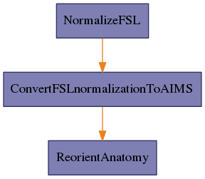

.. AUTO-GENERATED FILE -- DO NOT EDIT!

:orphan:

morphologist.capsul.axon.fslnormalizationpipeline.FSLnormalizationPipeline
==========================================================================

.. _morphologist.capsul.axon.fslnormalizationpipeline.FSLnormalizationPipeline:

FSLnormalizationPipeline
------------------------

.. currentmodule:: morphologist.capsul.axon.fslnormalizationpipeline

.. note::

    * Type 'FSLnormalizationPipeline.help()' for a full description of this process parameters.
    * Type '<FSLnormalizationPipeline>.get_input_spec()' for a full description of this process input trait types.
    * Type '<FSLnormalizationPipeline>.get_output_spec()' for a full description of this process output trait types.

Inputs
~~~~~~

[Mandatory]

+--------------------------------------------------------------------------------+
| | **set_transformation_in_source_volume**: a boolean (['Bool'] - mandatory)    |
| |     No description.                                                          |
+--------------------------------------------------------------------------------+
| | **t1mri**: a file name (['File'] - mandatory)                                |
| |     No description.                                                          |
+--------------------------------------------------------------------------------+
| | **allow_retry_initialization**: a boolean (['Bool'] - mandatory)             |
| |     No description.                                                          |
+--------------------------------------------------------------------------------+
| | **template**: a file name (['File'] - mandatory)                             |
| |     No description.                                                          |
+--------------------------------------------------------------------------------+
| | **nodes_activation**: a legal value (['ControllerTrait'] - mandatory)        |
| |     No description.                                                          |
+--------------------------------------------------------------------------------+
| | **alignment**: a legal value (['Enum'] - mandatory)                          |
| |     No description.                                                          |
+--------------------------------------------------------------------------------+
| | **allow_flip_initial_MRI**: a boolean (['Bool'] - mandatory)                 |
| |     No description.                                                          |
+--------------------------------------------------------------------------------+

[Optional]

+---------------------------------------------------------------------------------+
| | **NormalizeFSL_cost_function**: a legal value (['Enum'] - optional)           |
| |     No description.                                                           |
+---------------------------------------------------------------------------------+
| | **NormalizeFSL_init_translation_origin**: a legal value (['Enum'] -           |
| |     optional)                                                                 |
| |     No description.                                                           |
+---------------------------------------------------------------------------------+
| | **ReorientAnatomy_commissures_coordinates**: a file name (['File'] -          |
| |     optional)                                                                 |
| |     No description.                                                           |
+---------------------------------------------------------------------------------+
| | **ConvertFSLnormalizationToAIMS_standard_template**: a legal value            |
| |     (['Enum'] - optional)                                                     |
| |     No description.                                                           |
+---------------------------------------------------------------------------------+
| | **NormalizeFSL_search_cost_function**: a legal value (['Enum'] - optional)    |
| |     No description.                                                           |
+---------------------------------------------------------------------------------+

Outputs
~~~~~~~

+----------------------------------------------------------------------+
| | **ReorientAnatomy_output_commissures_coordinates**: a file name    |
| |     No description.                                                |
+----------------------------------------------------------------------+
| | **NormalizeFSL_normalized_anatomy_data**: a file name              |
| |     No description.                                                |
+----------------------------------------------------------------------+
| | **reoriented_t1mri**: a file name                                  |
| |     No description.                                                |
+----------------------------------------------------------------------+
| | **ConvertFSLnormalizationToAIMS_write**: a file name               |
| |     No description.                                                |
+----------------------------------------------------------------------+
| | **NormalizeFSL_transformation_matrix**: a file name                |
| |     No description.                                                |
+----------------------------------------------------------------------+
| | **transformation**: a file name                                    |
| |     No description.                                                |
+----------------------------------------------------------------------+

Pipeline schema
~~~~~~~~~~~~~~~

