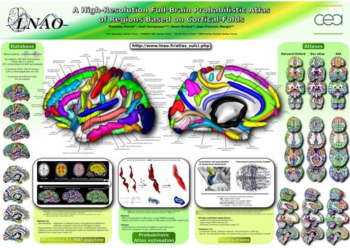

Morphologist
============

Brain segmentation and sulcal analysis

.. .. raw:: html
..     :file: carousels/car_morphologist_big.html

.. [FISCHER2012] C. Fischer, G. Operto, S. Laguitton, M. Perrot, I. Denghien, D. Rivière, and J.-F. Mangin: **Morphologist 2012: the new morphological pipeline of BrainVISA**, In *Proc. HBM*, 2012. :web:`link <biblio/brainvisa/en/Year/2012.html#Fiescher12>` :web:`bibtex-entry <biblio/brainvisa/en/Year/2012.complete.html#Fischer12>`

Morphologist UI
---------------

Morphologist now has a new graphical interface, featuring simplified user experience and quick interactive visualization:

Docmentation :morphouiusr:`can be found here <index.html>`

It can be run either as a standalone program (``morphologist``), or through BrainVISA.

Morphologist toolbox in Brainvisa
---------------------------------

* Slides on the :morphologist:`Morphologist pipeline <morphologist.pdf>`

* :morphoproc:`Morphologist toolbox documentation <categories/morphologist/category_documentation.html>`

* :morpho_api:`Developers documentation <index.html>`

Morpho-DeepSulci
----------------

* :morphodeep_dev:`The new (2019) sulcal identification algorithms and processes <index.html>`

SulPatEd
--------

Sulpated, "Sulcal Patterns Editor" is a graphical interface to manually label sulci and sulcal patterns. See the doc in the dedicated page.

:doc:`sulpated`

BSA Atlas (Brainvisa Sulci atlas) v.2011
----------------------------------------

* Atlas view in 3D: :morphologist:`see this little demo <webgl_demo/webgl.html>`

This atlas gives the probability of finding various cortical folds or gray nuclei across a population.

    Probability maps

    Probability maps corresponding to a few anatomical landmarks (cortical folds) overlaid on a T1 template

    Outlines

    The outline at 50% of all the structures

    Labels location

    Location of sulcal labels mapped on a 3D representation of a refined version of the anatomical atlas (after a sulcuswise non-linear registration scheme).

    HBM 2011 poster

    A high-resolution full-brain probabilistic atlas of regions based on cortical folds

    Atlas of Sulci with nomenclature table

    Location of sulci named by their Brainvisa acronyms or their full anatomical names

Downloads
+++++++++

* `Download the Atlas <https://brainvisa.info/download/data/anat_landmark_atlas.nii.gz>`_ (nii.gz file, 71Mo, in MNI space, 2mm isotropic voxels)

* `Table giving the names of the anatomical structures <_static/images/bsa/anat_landmark_atlas.csv>`_ (csv file)

* `CSV of anatomical structures <_static/images/bsa/anat_landmark_atlas.csv>`_ - fields : index, location (x,y,z), color(r,g,b), brainvisa acronym and anatomical label.

* `Table of sulcal labels <_static/images/bsa/anat_landmark_atlas_table.pdf>`_ - Meanings of Brainvisa acronyms used for sulcal structures

* The :documents:`older sulci labels used before BrainVisa/Morphologist 3.2 <nomenclature/BV_nomenclature.pdf>`, and handled by the older ANN models 2001. There are slight changes, but there are changes.

References
++++++++++

Atlas estimation
################

.. [PERROT2009] M. Perrot, D. Riviere, A. Tucholka, J.-F. Mangin : **Joint Bayesian Cortical Sulci Recognition and Spatial Normalization**, *IPMI* 2009 :web:`link <biblio/brainvisa/en/Year/2009.html#Perrot09>` :web:`bibtex-entry <biblio/brainvisa/en/Year/2009.complete.html#Perrot09>` `paper <http://www.springerlink.com/content/kr237xh45132283u/>`_

.. [PERROT2011] M. Perrot, D. Rivière, and J.-F. Mangin. **Cortical sulci recognition and spatial normalization**. *Medical Image Analysis* 2011 :web:`link <biblio/brainvisa/en/Year/2011.html#Perrot11>` :web:`bibtex-entry <biblio/brainvisa/en/Year/2011.complete.html#Perrot11>` `paper <http://www.sciencedirect.com/science?_ob=MImg&_imagekey=B6W6Y-52BPK8B-1-3W&_cdi=6611&_user=2432700&_pii=S1361841511000302&_origin=&_coverDate=08%2F31%2F2011&_sk=999849995&view=c&wchp=dGLbVlz-zSkzk&md5=da7babd94f7373e9a907a63d9c57a035&ie=/sdarticle.pdf>`_

Applications
############

Defining anatomo-functional parcels
!!!!!!!!!!!!!!!!!!!!!!!!!!!!!!!!!!!

.. [TUCHOLKA2008] Alan Tucholka, Bertrand Thirion, Matthieu Perrot, Philippe Pinel, Jean-François Mangin and Jean-Baptiste Poline : **Probabilistic Anatomo-Functional Parcellation of the Cortex : How Many Regions ?**, *MICCAI* 2008 :web:`link <biblio/brainvisa/en/Year/2008.html#Tucholka08b>` :web:`bibtex-entry <biblio/brainvisa/en/Year/2008.complete.html#Tucholka08b>` `paper <http://www.springerlink.com/content/qk36n3m522554367/>`_

Refining functional MRI analysis
!!!!!!!!!!!!!!!!!!!!!!!!!!!!!!!!

.. [KELLER2009] Merlin Keller, Marc Lavielle, Matthieu Perrot and Alexis Roche. **Anatomically Informed Bayesian Model Selection for fMRI Group Data Analysis**. *MICCAI* 2009 :web:`link <biblio/lnao/en/Year/2009.html#Keller09>` :web:`bibtex-entry <biblio/lnao/en/Year/2009.complete.html#Keller09>` `paper <http://www.springerlink.com/content/u04520x4v0t17524/>`_

Functional connectivity
!!!!!!!!!!!!!!!!!!!!!!!

.. [VAROQUAUX2010] Gaël Varoquaux, Alexandre Gramfort, Jean-Baptiste Poline, Bertrand Thirion. **Brain covariance selection : better individual functional connectivity models using population prior**. *NIPS* 2010 `paper <https://arxiv.org/pdf/1008.5071>`_

