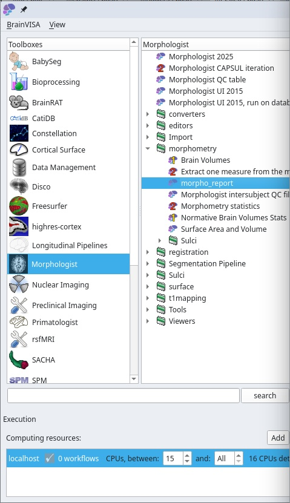
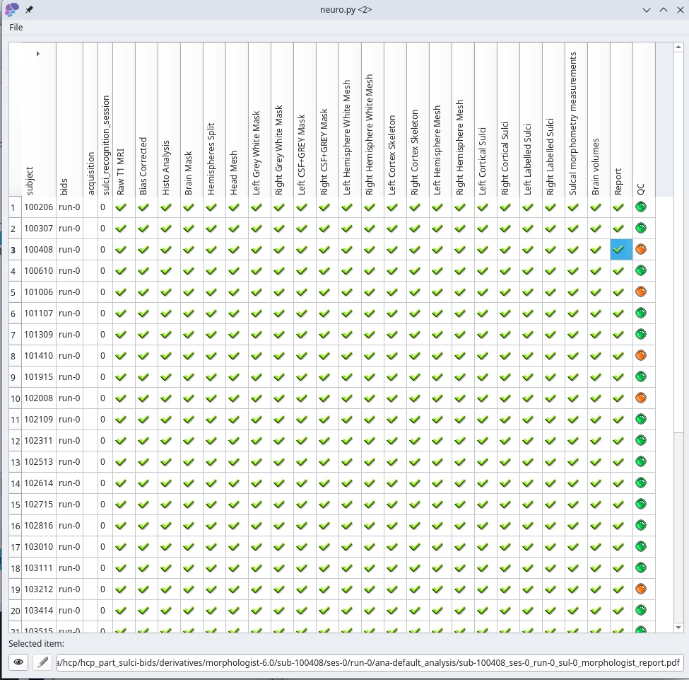
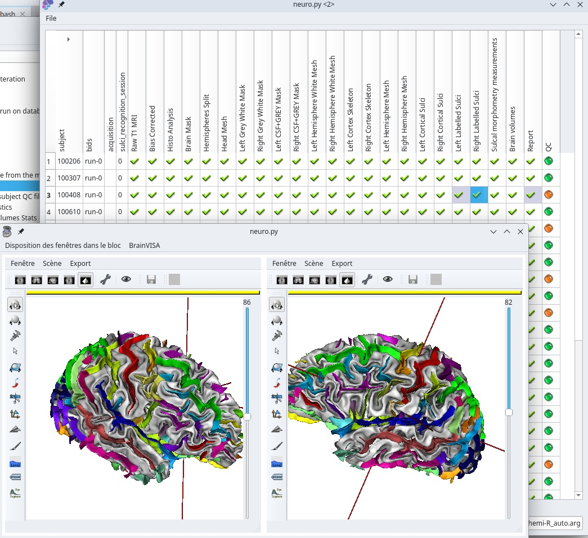
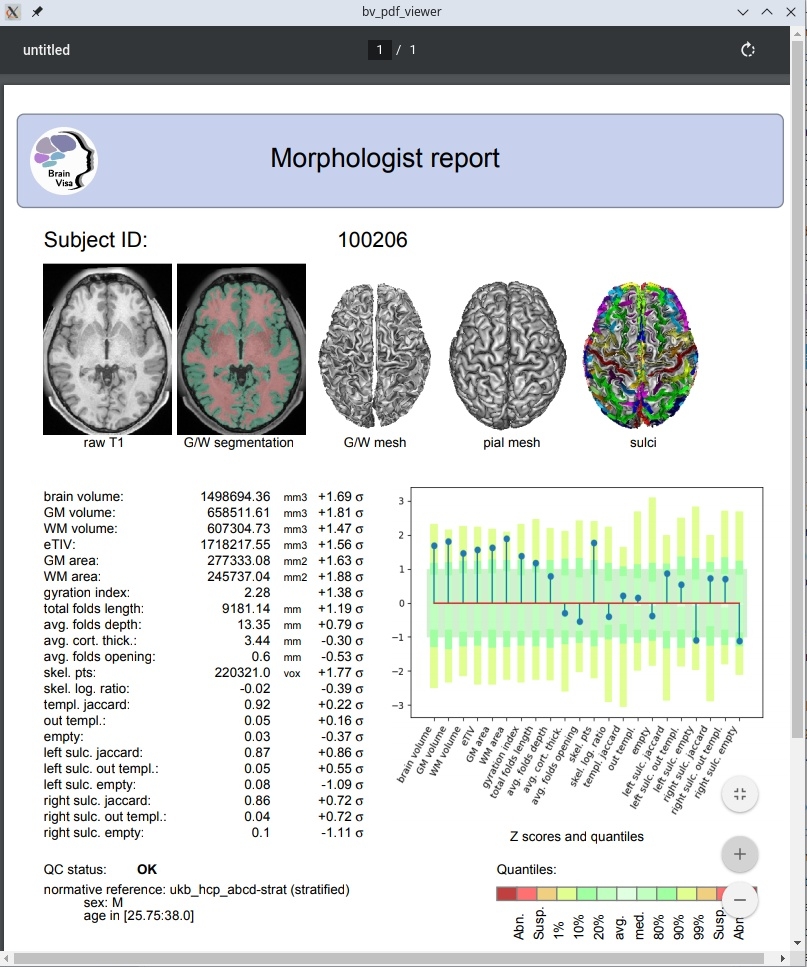

===============
Morphologist QC
===============

Morphologist now runs additional steps which perform some global measurements on segmented brains, and a QC which checks whether these measurements are within expected ranges.

A table allows to display, at dataset level, the main outputs of the Morphologist pipeline, and show whether thay have been produced or not, and if the QC checks dit notice anything suspicious.

QC table in Axon (Brainvisa classic)
====================================

* Double-clicking on an item (an existing output file) triggers a viewer process

* Based on database queries in the Brainvisa database.
* So, suffers the same limitations and bottlenecks as all data in BrainVisa.

QC table in Capsul
==================

The QC table process has been ported to Capsul infrastructure.

* Free from BrainVisa/Axon's bottlenecks
* Commandline-based
* Has a filesystem bottleneck unless a database is built (see below)
* Using a database, can manage large datasets
* Viewers do also work as in Axon, but without autimatic inter-subject coordinates sytem management, so far

Using files status checks
-------------------------

::

    bv python -m capsul -y -i /data/hcp_part_sulci-bids/derivatives/morphologist-6.0 \
        --if morphologist-bidfs-2.0 morphologist.capsul.qc.morphologist_qc_table

Note the ``-y`` parameter in the commandline, which tells that the process to be run is an interactive GUI process, so the program should not just quit after runing. If you forget it, the commandline will just exit without having time to show anything to the user. It may be useful to save a document (HTML or PDF output) without interaction.

This version scans files in the dataset, which is OK for a small dataset on a local filesystem, but for large datasets on remote filesystems, it runs into a bottleneck...

Using a database
----------------

To overcome this, we need to build a Capsul database file::

    bv python -m capsul -i /data/hcp_part_sulci-bids/derivatives/morphologist-6.0 \
        --if morphologist-bidfs-2.0 morphologist.capsul.qc.index_db

This process scans the dataset directory and builds a ``capsul-<version>.sqlite`` database which can be reused afterwards.

Then::

    bv python -m capsul -y -i /data/hcp_part_sulci-bids/derivatives/morphologist-6.0 \
        --if morphologist-bidfs-2.0 morphologist.capsul.qc.morphologist_qc_table \
        database_sqlite=/data/hcp_part_sulci-bids/derivatives/morphologist-6.0/capsul-2.6.sqlite \
        index_status=Force

The ``index_status`` parameter here tells to index in the database status files contents, which need to be read once, which can be long if the dataset is large.

Once it is done once, the parameter `index_status=Force` should be removed (or replaced with `index_status=Use`) so that the status is now queried from the database and not read from files::

    bv python -m capsul -y -i /data/hcp_part_sulci-bids/derivatives/morphologist-6.0 \
        --if morphologist-bidfs-2.0 morphologist.capsul.qc.morphologist_qc_table \
        database_sqlite=/data/hcp_part_sulci-bids/derivatives/morphologist-6.0/capsul-2.6.sqlite

Once database indexing is done, the QC table process can manage very large datasets (we use it on datasets of over 40000 subjects).

Do not forget however that files exsitance and statuses are no longer checked physically but just queried from the database: if files change, the database should be rebuilt, or the QC table will show outdated information. So it's OK for a processed dataset which will not change afterwards.

QC report
=========

The last step of the Morphologist pipeline is a QC report which produces both a ``JSON`` file and a ``PDF`` document. This document displays snapshots of key segmentation steps, and some of the brain mesurements.

* It may use normative stats to raise flags and warnings if some of the measurements are out of common ranges.

* Normative stats may be used gloablly (based on a population of different sex/ages), but may also be used in regard of matching "covariables" (namely age and sex here). For this to work, age and sex information have to be specified for the given subject. They can be provided in several different ways, either directly (manually) or using a "covariables file".

Specifying covariables by hand
------------------------------

Use the ``coavriables`` parameter, using a JSON dictionary syntax::

    {"sex": "M", "age": 35}

Specifying a covaribales file
-----------------------------

* The ``covariables_file`` optional parameter is meant to provide a sex and age information file for the subject, in order to use matched stratified normative data. So it is useful only when using such stratified normative data. This file is an alternative to the ``covariables`` parameter, and may contain several subjects, as long as the subject ID is found in the first table column. ``sex`` and ``age`` columns are needed in this table. The table may be the BIDS ``participants.tsv`` file, if the expected columns are present there.

* The ``covariables_spec`` parameter may be used optionally to replace ``covariables_file`` and ``covariables`` in the context of stratified normative data to compare global brain morphometric measurements. It allows to use covariables (normally ``age`` and ``sex``) which may be scattered in multiple files, and add data filters and values transformations. The string here is a ``JSON`` dictionary secifying, for each covariable, where and how to find it.

  Example (inspired by the ABCD cohort phenotypes files)::

        {"age": {
            "filename": "/data/abcd/phenotype/ab_g_dyn.tsv",
            "var_in_file": "ab_g_dyn__visit_age",
            "filter": {"session_id": "ses-00A"}},
         "sex": {
            "filename": "/data/abcd/phenotype/ab_g_stc.tsv",
            "var_in_file": "ab_g_stc__cohort_sex",
            "interpret": {"1": "M", "2": "F"}}}

  This means that ``age`` and ``sex`` variables are found in different files (``ab_g_dyn.tsv`` and ``ab_g_stc.tsv`` respectrively) under column names ``ab_g_dyn__visit_age`` and ``ab_g_stc__cohort_sex``, that the subject age table has to be filtered using only ``session_id`` column value being ``ses-00A`` (the baseline of a longitudinal study where the same subject may have multiple acquisitioins at different ages), and the ``sex`` value is not ("``M``", "``F``") as expected, but numerical values (``1``, ``2``) which need to be translated.

  The ``filter`` value may be:

  * a single value (test if the column matches this exact value)
  * an operator and a value, ex: ``>= 27.5``
  * a python expression using ``%(x)s`` to reference the variable: ``np.logical_and(%(x)s >= 27.5, not np.isnan(%(x)s)``

  The ``interpret`` field may be a dict as in this example to simply translate values, or a string naming a translation function. To date, the only valid values are:

  * ``months`` is understood to translate age in months into years.
  * ``item_index`` with an int index parameter, ex: ``item_index(0)``, takes the item at given index in a coma-separated list.
  * ``item_index_float`` with an int index parameter, ex: ``item_index_float(0)``, takes the item at given index in a coma-separated list, and converts it to float.
