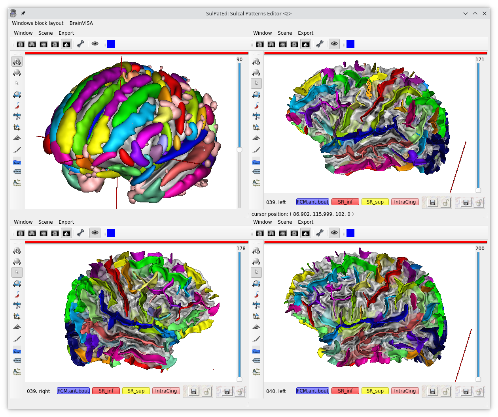

========
SulPatEd
========

Introduction
============

Sulcal Patterns Editor: edit patterns labels for a brainvisa database.

Sulpated, is a graphical interface to manually label sulci and sulcal patterns.

It is originally a "small tool program" and its setup is not completely automatic. This means there is a config file to write.

It may be used also to perform manual edition or correction of sulci labels, before or after automatic identification in Morphologist.

Sulcal patterns
---------------

Sulcal patterns are local folding configurations that we identify manually. Thus, it is merely a matter of annotating a brain with patterns which are present. Going a bit further we can also write a confidence factor and text notes associated with each pattern.

Summary
=======

* reads a BV sulci database with labeled sulci
* writes pattern information in another output database
* handles locking ands conflicts between several users working on the same data, backups are saved

The program is run using the follwing base command, with additional options (see later):

.. code-block:: bash

    python3 -m morphologist.sulpated

A config file is expected in the output database directory, this file should be named ``patterns_def.json``. See the `Write a config file`_ section for details.

If the config file contains the sulci and input database locations, then the sulci and input databases commandline parameters (``-s``/``-i`` options) are not needed.
If the config file contains the region information, then the region commandline parameter (``-r``) is not needed.
An input database query filter is applied to select data we are working on (for instance select a sulci recognition session). This query may be either passed on the commandline (``-f`` option), or given in the config file.

Files, conflicts and backup files:
----------------------------------

Output pattern files are written in the output directory.

Output sulci graphs are written in the "sulci" database. If an earlier save of the same data is present, il will be overwritten. Use the "input" database (``-i``) to avoid this.

When a conflict is detected: ie another user has saved a file after we have read and modified it, then the new file will be saved at a different place in order to avoid overwriting and losing the other user modifications. The backup location is always in the output database, and suffixed with ``.backup.<user>``, ``<user>`` being the user login.

There is currently no tool to display diffs and resolve conflicts: the user has to do it by his own. Normally it should not happen often.

Before starting
===============

Create an output patterns data directory
----------------------------------------

This is the directory where pattern information, and possible backups will be saved in.

Setup Brainvisa databases
-------------------------

* Read/write database (needed): a BV database has to be defined and enabled in Brainvisa in order to read and write sulcal graphs in. It is the "sulci" database. It may be located inside the output patterns data directory.

* Optionnally, an additional read-only database can be defined and enabled in BrainVisa. It is the "input" database. It will be used to read input sulci graphs from. Nothing will be written into it, everything will be written in the "sulci" database.

If a read-only "input" database is used, then the "sulci" database may be empty at the beginning. However all databases used **must have been created, defined and enabled in BrainVISA**. If not, Sulpated will fail with an error, which is not always very explicit (it is just a small program).

Write a config file
-------------------

``patterns_def.json`` is a JSON format file. It should contain, at least, the patterns definition, plus optionally input database information.

Config file contents:

* ``patterns_definition``: a dict of regions with patterns inside
  Patterns are a dict of pattern names with associated items, for now just a color
  ex::

      "patterns_definition":
      {
          "orbito_frontal": {
              "P1": {"color": [1, 0, 0]},
              "P2": {"color": [1, 1, 0]},
              "P3": {"color": [0, 0, 1]}
          }
      }

* ``database_definition``: optional dict which may contain:

  * ``database_filter``: optional dict with brainvisa filter values, ex::

      "database_filter":
      {
          "sulci_recognition_session": "default_session",
          "graph_vsersion": "3.1"
      }

  * ``output_database_filter``: optional dict with brainvisa filter values, like for database_filter, but applies to output sulci graphs, in addition to database_filter (and higher priority). Having an output filter allows to write output data with different attributes, like ``sulci_recognition_session`` or ``graph_version`` for instance.
  * ``region``: optional string, specifies the working region name. ex::

      "region": "orbito_frontal"

  * ``sulci_database``: optional string, specifies the location of the sulci database (read/write to allow saving modified labeled sulci graphs)
  * ``input_database``: optional string, specifies the location of an additional input, read-only, sulci database. Sulci will be read from here only if they are not found in the sulci_database, and all will be written in the sulci_database.
  * ``force_sulci_locks_state``: optional boolean, specifies if locks should be assumed to a given value instead of all read from disk::

      "force_sulci_locks_state": true

    for large databases, reading the locks simply takes too long, and we need to use this option. Forcing the value to ``true`` is riskier, but anyway locks will be really checked before saving any data.

See `Example of full config file`_

The GUI
=======

Then run the following command from a terminal inside the BrainVisa container

.. code-block:: bash

    python3 -m morphologist.sulpated -o /path/to/data

The ``-o`` option is not needed if it is started from the output patterns directory.

Main window
-----------

Patterns are displayed in columns, as defined in the config ``patterns_def.json`` file. Colors are also defined in the config (thus if they are ugly, it's just because I have set them almost randomly in this example).

Status columns will show when data have been modified by the user.

The status background is light yellow if the data has been saved (after edition).

Locked data are not editable, so it's a reasonable and convenient way to mark validated data.

Sulci columns checkboxes allow to load / show sulci graphs.

Save buttons allow to save each corresponding data. **Beware** there is as "save" (patterns) column, and a "save sulci" column.

To avoid confusions, **pattern-oriented colums** have a background with a pattern icon (light hexagonal tiles), while **sulci-oriented columns** have a "sulci" background. It's not very pretty, but it makes things clearer.

Display sulci model: allows to show in the 3D views the sulci models from Morphologist, with all available labels.

Annotations are associated with each pattern of each subject / hemisphere. They are saved with the patterns of each subject (in a JSON file).

Sulci views window
------------------

Features and status of the implementation
=========================================

.. |ok| raw:: html

    [ok]

.. |notok| raw:: html

    [Not done]

.. |todo| raw:: html

    [TO DO]

.. |partly| raw:: html

    [Partly done]

.. |mostly| raw:: html

    [Mostly done]

.. |notneeded| raw:: html

    [Not needed ?]

.. |todo_1| raw:: html

    [no interface]

.. |todo_2| raw:: html

    [TODO for patterns, done for sulci]

.. |nolock| raw:: html

    [no lock]

* used by several users concurrently. Each user should see updated data (real time), modify, save without side effect on other users (working on different subjects)

* table displaying all subject, todo, existing data, done (validated + locked) |mostly|

* locking system for both concurrent access and protection of validated data |ok|

* [auto-save ?]                                                        |notok|

* edit sulci manual labelings                                             |ok|

  * convert auto to manual labelings                                      |ok|

* enter labels for a subject, with possible annotations                   |ok|

  * multiple labels                                                       |ok|
  * confidence                                                            |ok|
  * notes                                                                 |ok|

* the GUI should be very easy to use (single button?) and should display info clearly                                                                   |ok|

  * Use clear icons                                                     |todo|

* conflicts handling                                                  |mostly|

  - backup save                                                           |ok|
  - conflicts list                                                        |ok|
  - conflicts resolution interface ?                                   |notok|
  - force write: unlock |ok|
  - abort / revert user version                                         |todo|

* multi-subject 3D views window                                       |partly|

  in each, display:

  - subject name/ID                                                       |ok|
  - 3D sulci                                                              |ok|
  - buttons for labels                                                    |ok|

    - one color per label ?                                               |ok|
    - with label names displayed only once in the window ?
    - label name as tooltip ?                                           |todo|

  - [labels confidence / annotations ?] or this can be opened specifically and temporarily on a user action (menu, button)                          |notok|
  - save button, displaying unsaved state                                 |ok|
  - save / load in a separate output database                             |ok|
  - validate / lock button                                                |ok|
  - unlocking should require a confirmation                               |ok|
  - notification / update when data (sulci graph or labels file) is modified externally by another user                                              |ok|
  - handle conflicts: I have modified, not saved yet, but someone else has, in the meantime

    - change colors / grey the whole subject                           |notok|
    - allow / suggest to save things at another place to resolve conflicts |ok|

- allow to discard unsaved changes (with confirmation)                |partly|

  - [notify when starting to edit a subject, other users will be notified] ? |notok|

    - means to "unlock" if the edition is aborted (quit the program, close the subject, or user action to tell that we abort)
    - tool to manually unlock a subject after a crash which has not unlocked it

  - [undo / redo capabilities] (difficult to implement in the short term)
  - [back up older files ?]

Technical

- JSON or YAML file for each subject / region                             |ok|
- or single inter-subject file [not implemented this way]
- or database [not implemented this way; impractical for end users]

- file locking system                                                     |ok|
- file modification notification system to update GUI, (or database modification notification)                                                |ok|

  - use brainvisa/Axon API to query data ?
  - but NFS locking issue prevents it for being reliable
  - use a locking wrapper to database access ? -> will slow things down even more... but if we limit the accesses it might do the job                |ok|

- data states:

  - to do
  - editing (temp. locked)                                             |notok|
  - saved                                                                 |ok|
  - validated (permanently locked)                                        |ok|

- actions:

  - edit labels list (global, for all subjects / users)               |todo_1|
  - start edit [auto] (temp lock)                                      |notok|
  - change a label state                                                  |ok|
  - edit label confidence                                                 |ok|
  - edit label annotation                                                 |ok|
  - save (unlock temp)                                                    |ok|
  - abort (revert to saved, unlock temp)                              |todo_2|
  - lock                                                                  |ok|
  - unlock                                                                |ok|
  - edit sulci labels (temp lock)                                     |nolock|
  - abort sulci labels (revert, unlock temp)                          |nolock|
  - save sulci labels (unlock temp)                                   |nolock|
  - validate sulci labels ?                                               |ok|

- all lock / unlock actions must notify something, or anyway be listened by other users

  - global version/date database file, used for notification/polling, with lock
    maybe including all data dates/versions in order to quickly know what has
    changed                                                               |ok|
  - subject/hemi sulci graph lock                                  |notneeded|
  - subject patterns file lock                                     |notneeded|
  - database "version file" lock                                          |ok|

Open questions:

  - do we want to auto-reload loaded sulci graphs when they are changed externally ? If not, what should be displayed ?
  - do we need to have a lock during edition ? (temp lock)
  - do we want to auto-save sulci graphs ? Where ?
  - is "validaton" and "locking" the same ?
  - do we want to keep track of who has modified a data ? (would almost need a RCS to be done correctly)
  - is it a bottleneck to poll every file when the global version file is touched, or do we need to cache every data state in the version file ? (could involve additional sync issues)

Example of full config file
===========================

::

    {
        "database_definition":
        {
            "database_filter":
            {
                "sulci_recognition_session": "session1",
                "graph_version": "3.3"
            },
            "output_database_filter":
            {
                "graph_version": "3.3",
                "sulci_recognition_session": "base2023"
            },
            "region": "SR",
            "ro_database": "/home/dr144257/data/archi-sulci",
            "sulci_database": "/home/dr144257/data/archi-sulci-sulpat/archi-sulci-2023"
        },
        "patterns_definition":
        {
            "SR": {
                "FCM.ant.bout": {
                    "color": [0, 0, 1]
                },
                "SR_inf": {
                    "color": [1, 0, 0]
                },
                "SR_sup": {
                    "color": [1, 1, 0]
                },
                "IntraCing": {
                    "color": [1, 0.5, 0.5]
                }
            }
        }
    }

